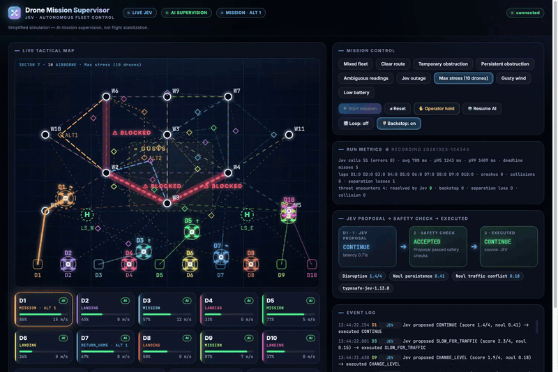

# reflex-drone-flight-control

A small simulator for testing a **decision model as a reflex** in drone-fleet control.

Up to 10 simulated drones share one map, the same waypoints and one cruise altitude (45 m). Roughly once a second, per drone, a decision model picks one action from a closed set (CONTINUE, HOLD, SLOW_FOR_TRAFFIC, CHANGE_LEVEL, RETURN_HOME, LAND_AT_SITE, ...). It has no plan and no memory of its last answer. Deterministic rules can veto or override it, and every override is logged as `OVERRIDDEN`. An optional deterministic **backstop** (brake, separate, move vertically when drones get too close) can be switched on or off, so you can measure what the model does alone and what the backstop adds.

The decision model is a black box reached over HTTP. The default client targets the Jev gateway; a built-in mock lets you run everything offline.



*Five seconds of a real run: each drone gets a Jev proposal (CONTINUE, SLOW_FOR_TRAFFIC, CHANGE_LEVEL, RETURN_HOME, ...), a safety check, and the executed action.*

Not a flight controller: the physics is a simplified kinematic model and the thresholds are demo values.

## Requirements

- [uv](https://docs.astral.sh/uv/) (`brew install uv` or `curl -LsSf https://astral.sh/uv/install.sh | sh`). It installs a working Python for you, so the system Python doesn't matter.
- Optional: a Jev API key for live decisions

## Quick start (offline, no key)

```bash
git clone <this repo> && cd reflex-drone-flight-control
uv venv --python 3.11 && source .venv/bin/activate
uv pip install -r requirements.txt

JEV_MODE=mock uvicorn backend.app:app --reload --port 8000
```

Open http://localhost:8000. The UI shows a MOCK badge when the mock is in use. The mock is a simple heuristic for UI testing; do not use it for results.

Without activating anything, `uv run` also works:

```bash
JEV_MODE=mock uv run --no-project --python 3.11 --with-requirements requirements.txt uvicorn backend.app:app --port 8000
```

If `uv venv` says a `.venv` already exists (for example from a failed `python3 -m venv`), run `rm -rf .venv` first.

## Live decision model

```bash
cp .env.example .env     # then edit .env and set JEV_API_KEY
uvicorn backend.app:app --reload --port 8000
```

`.env` is git-ignored. Never commit a key.

## Configuration (environment variables or `.env`)

| Variable | Default | Meaning |
|---|---|---|
| `JEV_API_KEY` | none | Gateway key (live mode) |
| `JEV_ENDPOINT` | Jev gateway URL | Decision-model HTTP endpoint |
| `JEV_MODEL` | `typesafe-jev-1.13.0` | Model name sent with each request |
| `JEV_MODE` | `live` | `mock` for the offline heuristic |
| `JEV_TIMEOUT` | `8` | Seconds before a call counts as a failure |
| `N_DRONES` | `10` | Number of drones, up to 10 |
| `BACKSTOP` | `1` | `0` turns the deterministic backstop off |
| `SIM_SPEED` | `1` | Sim seconds per wall second |
| `RECORD` | `1` | `0` disables writing run files |

## Headless runs and analysis

Run the same loops without a browser. Results are written to `runs/<timestamp>/` (telemetry, decisions, events, `summary.json`).

```bash
# 30 simulated minutes, Max stress scenario, backstop off, 10x speed
BACKSTOP=0 python -m backend.soak --minutes 30 --scenario stress --speed 10

python tools/analyze.py runs/<timestamp>
```

Run it once with `BACKSTOP=0` and once with `BACKSTOP=1` to compare. Wall-clock timing and model latency change the trajectories, so a single run per setting is indicative only.

## Tests

```bash
uv pip install -r requirements-dev.txt
pytest
```

## Layout

```
backend/app.py     FastAPI app, fleet, arbitration, backstop, decision loops
backend/sim.py     world, drones, scenarios, battery and wind rules
backend/jev.py     decision-model client (live HTTP and mock)
backend/static/    HTML/SVG dashboard
backend/soak.py    headless runner
tools/analyze.py   offline analysis of a recorded run
tests/             simulator and parsing tests
```

## License

MIT. See `LICENSE`.
